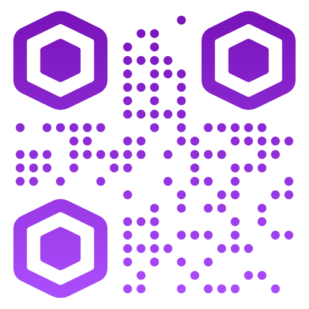
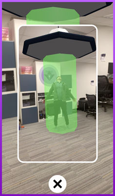
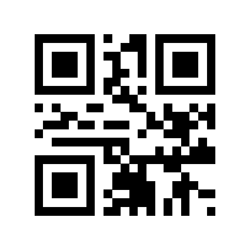
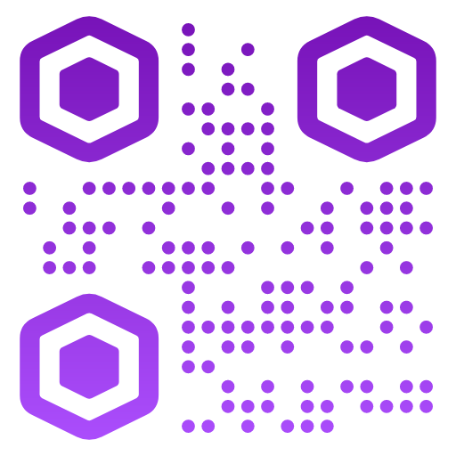
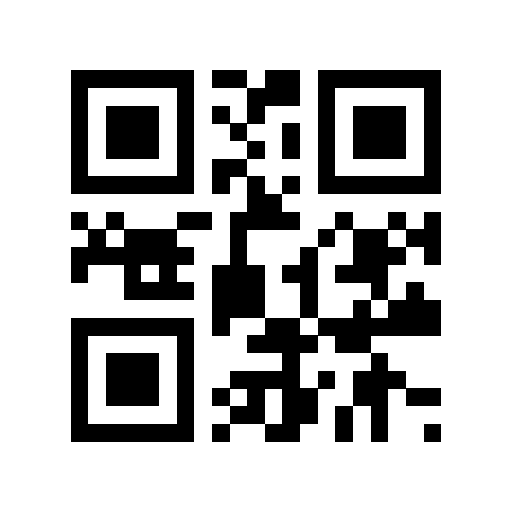
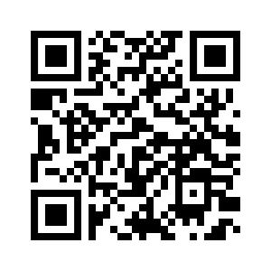
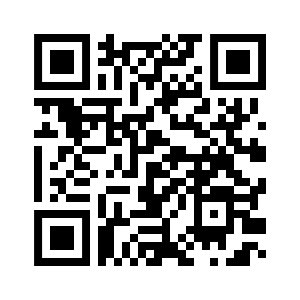

# 8th Wall Web Examples - AFrame

Example 8th Wall Web projects using AFrame:

* [Tap to place](https://github.com/8thwall/web/tree/master/examples/aframe/placeground) - This interactive example allows the user to grow trees on the ground by tapping. This showcases raycasting, instantiating objects, importing 3D models and the animation system.

* [Toss an object](https://github.com/8thwall/web/tree/master/examples/aframe/tossobject) - This interactive example lets the user tap the screen to toss tomatoes. When they hit the ground, they splat and make a sound. This introduces physics, collision events and playing sounds.

* [Portal](https://github.com/8thwall/web/tree/master/examples/aframe/portal) - This example shows off the popular portal illusion in web AR using three.js materials and the camera position as an event trigger.

* [Manipulate](https://github.com/8thwall/web/tree/master/examples/aframe/manipulate) - This example shows how to use touch gestures to manipulate a 3D object.

* [Capture a photo](https://github.com/8thwall/web/tree/master/examples/aframe/capturephoto) - This example allows the user to capture photo evidence of a UFO abduction.

* [Change animations](https://github.com/8thwall/web/tree/master/examples/aframe/animation-mixer) - This interactive example allows the user to position, scale, rotate, and change between animations embedded in a 3D model. This showcases raycasting, gesture inputs and using A-Frame's animation-mixer.

Tap to place | Toss Object | Portal 
:----------: | :---------: | :----: 
 |  | 
[Try Demo (mobile)](https://templates.8thwall.app/placeground-aframe) | [Try Demo (mobile)](https://templates.8thwall.app/tossobject-aframe) | [Try Demo (mobile)](https://templates.8thwall.app/portal-aframe)
or scan on phone:   | or scan on phone:   | or scan on phone:  

Manipulate | Capture a photo | Change animations
:--------: | :-------------: | :-------------:
 |  | 
[Try Demo (mobile)](https://templates.8thwall.app/manipulate-aframe) | [Try Demo (mobile)](https://templates.8thwall.app/capturephoto-aframe) | [Try Demo (mobile)](https://templates.8thwall.app/animation-mixer-aframe)
or scan on phone:   | or scan on phone:   | or scan on phone:  

## Marker Based

* [Art gallery](https://github.com/8thwall/web/tree/master/examples/aframe/artgallery) - This example uses image targets to show information about paintings in AR. This showcases image target tracking, as well as loading dynamic content and using the xrextras-generate-image-targets component.
* [Flyer](https://github.com/8thwall/web/tree/master/examples/aframe/flyer) - This example uses image targets to display information about jellyfish on a flyer. It uses the xrextras-named-image-target component to connect an <a-entity> to an image target by name while the xrextras-play-video component enables video playback.
* [Alpha Video](https://github.com/8thwall/web/tree/master/examples/aframe/alpha-video) - This example uses an image target to trigger a video. An A-Frame component is used for background removal of an mp4 video file to give a "green screen" effect.

Art gallery | Flyer | Alpha Video
:---------: | :---: | :---------:
 |  | 
[Image targets for demo](./artgallery/gallery.jpg) | [Image targets for demo](./flyer/flyer.jpg) | [Imaget target for demo](./alpha-video/targets/outside.jpg))
[Try Demo (mobile)](https://templates.8thwall.app/artgallery-aframe) | [Try Demo (mobile)](https://templates.8thwall.app/flyer-aframe) | [Try Demo (mobile)](https://templates.8thwall.app/alpha-video-aframe)
| or scan on phone:   | or scan on phone:   | or scan on phone:  
