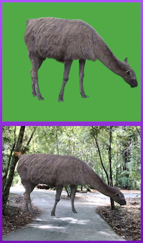
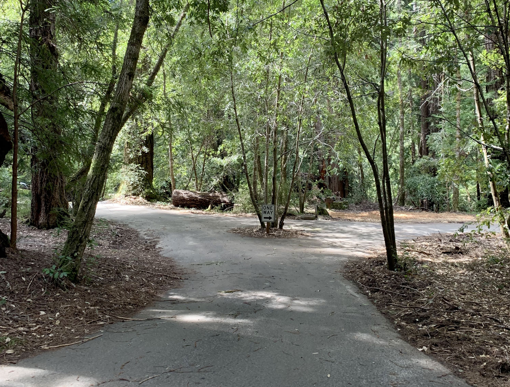
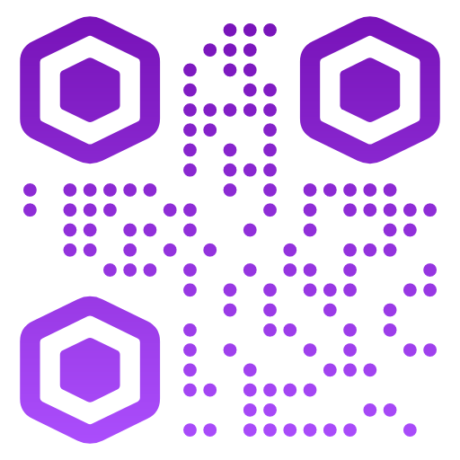

# 8th Wall Web Examples - AFrame - Alpha Video

This example uses an A-Frame component for background removal of an mp4 video file.

Check out the component [here](https://github.com/nikolaiwarner/aframe-chromakey-material/blob/master/README.md).

Use this image target to test:

[Try the live demo here](https://templates.8thwall.app/alpha-video-aframe)

or scan on phone:

