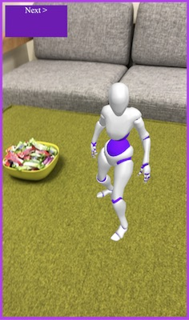

# 8th Wall Web Examples - AFrame - Change animations

This interactive example allows the user to position, scale, rotate, and change between animations embedded in a 3D model. This showcases raycasting, gesture inputs and using A-Frame's animation-mixer.

[Try the live demo here](https://templates.8thwall.app/animation-mixer-aframe)
