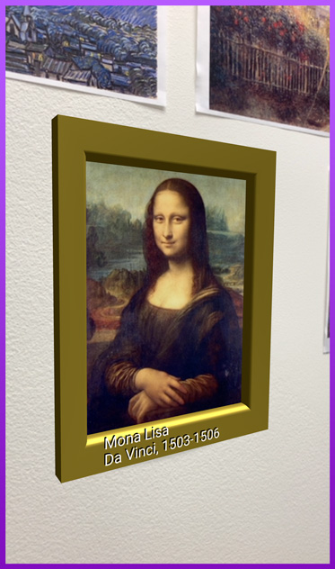
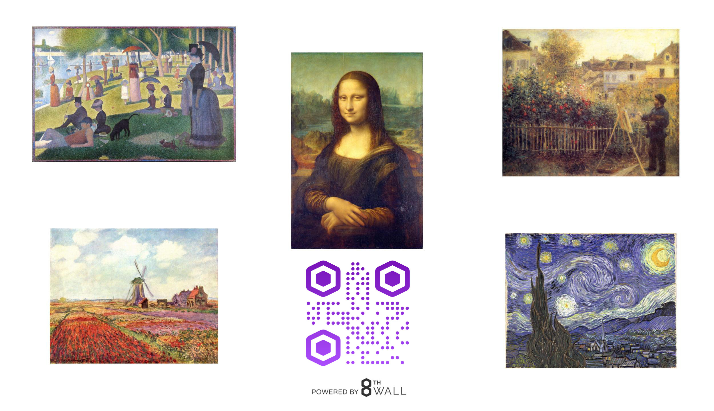

# 8th Wall Web Examples - AFrame - Art Gallery

This example uses image targets to show information about paintings in AR. This showcases image target tracking, as well as loading dynamic content and using the xrextras-generate-image-targets component.



[Try the live demo here](https://apps.8thwall.com/8thWall/aframe_artgallery)





## Uploading to Console

To link the image targets to your app key, you will need to upload each image to your app in console at console.8thwall.com.

Image target metadata allows us to generalize behaviors, linking specific data to the image targets themselves. Add the correct metadata to each image target on the console to make it available to your app.

```
{
  "title":"A Sunday Afternoon on the Island of La Grande Jatte",
  "artist":"Seurat",
  "date":"1884"
}

{
  "title":"Monet Tulip Fields With The Rijnsburg Windmill",
  "artist":"Monet",
  "date":"1886",
  "wikiTitle":"Claude Monet"
}

{
  "title":"The Starry Night",
  "artist":"Van Gogh",
  "date":"1889"
}

{
  "title":"Mona Lisa",
  "artist":"Da Vinci",
  "date":"1503-1506"
}

{
  "title":"Claude Monet painting in his Garden at Argenteuil",
  "artist":"Renoir",
  "date":"1873",
  "wikiTitle":"Pierre-Auguste Renoir"
}
```

