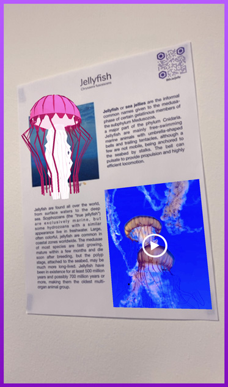
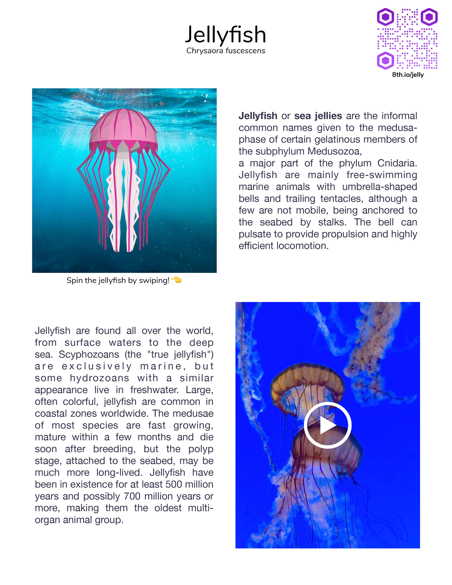

# 8th Wall Web Examples - AFrame - Flyer

This example uses image targets to display information about jellyfish on a flyer. It uses the xrextras-named-image-target component to connect an <a-entity> to an image target by name while the xrextras-play-video component enables video playback. 

[Try the live demo here](https://templates.8thwall.app/flyer-aframe)

## Uploading to Console

To link the image targets to your app key, you will need to upload and enable each image to your app in console at console.8thwall.com.
