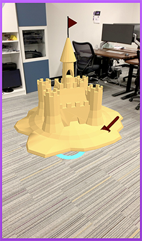

# 8th Wall Web Examples - AFrame - Manipulate

This interactive example allows the user to position, scale, and rotate an object. This showcases raycasting and gesture inputs.

[Try the live demo here](https://templates.8thwall.app/manipulate-aframe)
