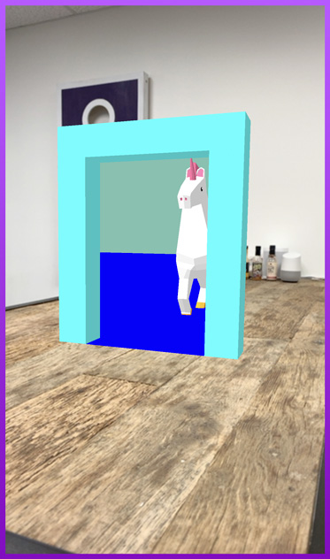

# 8th Wall Web Examples - AFrame - Portal

This example shows off the popular portal illusion in web AR using three.js materials and the camera position as an event trigger.

[Try the live demo here](https://templates.8thwall.app/portal-aframe)
