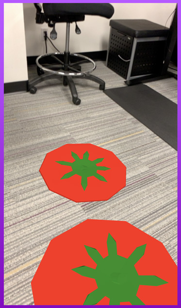

# 8th Wall Web Examples - AFrame - Toss an object

This interactive example lets the user tap the screen to toss tomatoes. When they hit the ground, they splat and make a sound. This introduces physics, collision events and playing sounds.

[Try the live demo here](https://templates.8thwall.app/tossobject-aframe)
