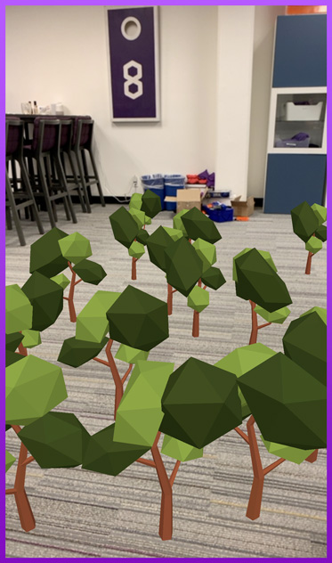

# 8th Wall Web Examples - Babylon.js

Example 8th Wall Web projects using Babylon.js:

* [Tap to place](https://github.com/8thwall/web/tree/master/examples/babylonjs/placeground) - This interactive example allows the user to grow trees on the ground by tapping. This showcases raycasting, instantiating objects, importing 3D models, and animation.

Tap to place 
:----------: 

[Try Demo (mobile)](https://templates.8thwall.app/placeground-babylonjs) 
or scan on phone:   
