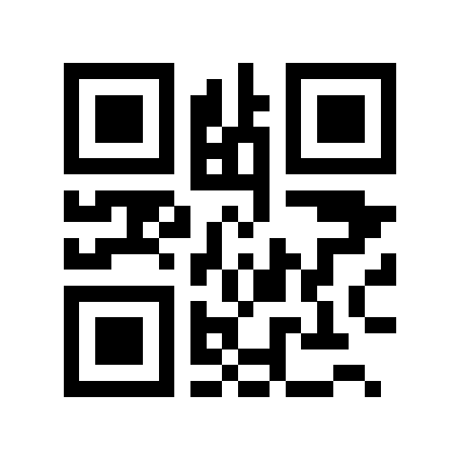

# 8th Wall Web Examples - Camera Pipeline

8th Wall Web's Markerless AR Tracking runs within a powerful camera application framework that is
designed to enable rapid development of highly efficient camera applications. This framework makes
it easy to build camera applications by taking over the hard work of binding to low level browser
apis, managing the application lifecycle, orchestrating run loops, and providing the needed hooks
for high throughput image processing within a web application. This means that application
developers can focus on what they care about, whether that's creating apps or developing new
computer vision technology.

The examples here illustrate the underlying framework that powers 8th Wall Web:

* [Camera Feed](https://github.com/8thwall/web/tree/master/examples/camerapipeline/camerafeed) - This is a minimal example of an app that opens the camera and draws the camera feed to the screen.

* [QR Code](https://github.com/8thwall/web/tree/master/examples/camerapipeline/qrcode) - This example illustrates how 8th Wall Web can be used in conjunction with third party or custom computer vision libraries. In this case, a javascript QR Code detection library is used to build a qr code scanner.

* [Simple Shaders](https://github.com/8thwall/web/tree/master/examples/camerapipeline/simpleshaders) - This example shows how the displayed camera feed can be customized through the use of simple glsl shaders.

Camera Feed | QR Code | Simple Shaders
:----------: | :---------: | :----:
 |  | 
[Try Demo (mobile)](https://templates.8thwall.app/camerapipeline-camerafeed) | [Try Demo (mobile)](https://templates.8thwall.app/camerapipeline-qrcode) | [Try Demo (mobile)](https://templates.8thwall.app/camerapipeline-simpleshaders)
or scan on phone:   | or scan on phone:   | or scan on phone:  
