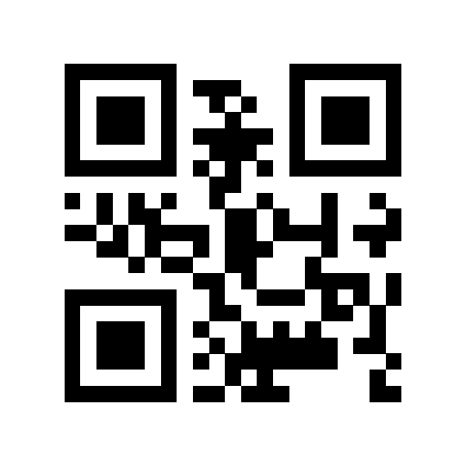

# 8th Wall Web Examples - Camera Pipeline - Camera Feed

This example shows how to create an 8th Wall Web that draws the camera feed over the entire
screen.

Camera Feed
:----------:

[Try Demo (mobile)](https://apps.8thwall.com/8thWall/camerapipeline_camerafeed)
or scan on phone:  
