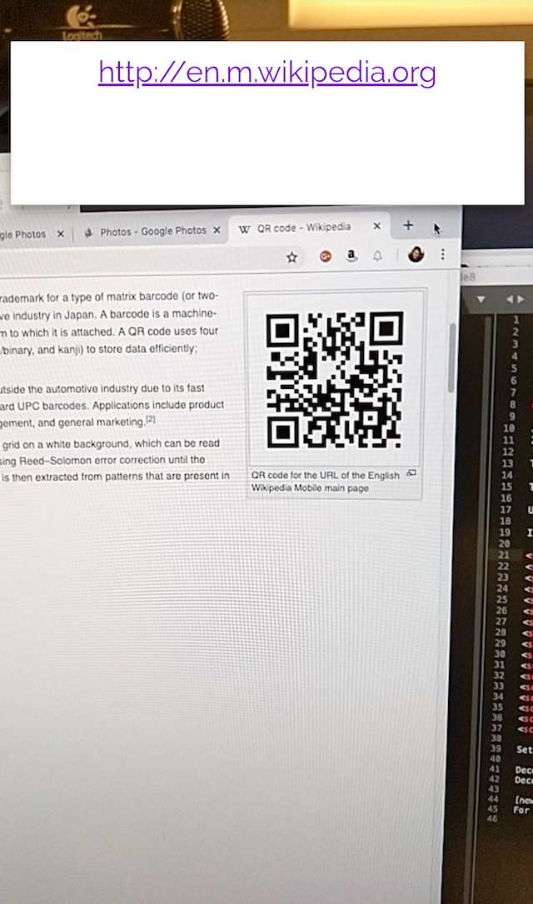
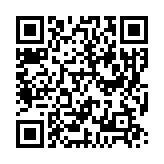

# 8th Wall Web Examples - Camera Pipeline - QR Code

This example shows how to create an 8th Wall Web that accesses the camera pixels and processes
them with a computer vision library.

QR Code
:----------:

[Try Demo (mobile)](https://apps.8thwall.com/8thWall/camerapipeline_qrcode)
or scan on phone:  
