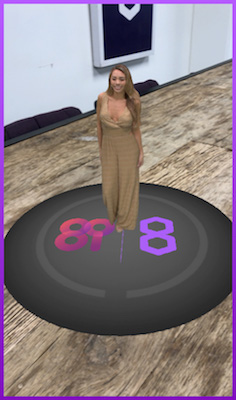
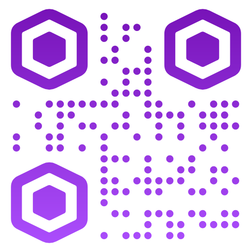
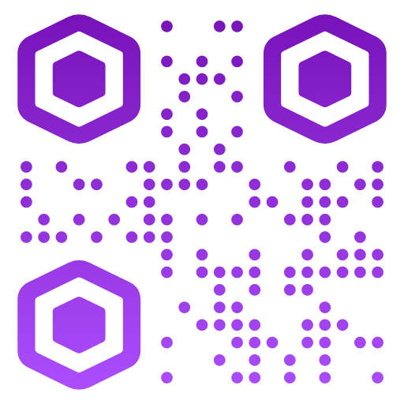

# 8th Wall Web Examples - three.js

Example 8th Wall Web projects using three.js:

* [Tap to place](https://github.com/8thwall/web/tree/master/examples/threejs/placeground) - This interactive example allows the user to grow trees on the ground by tapping. This showcases raycasting, instantiating objects, importing 3D models, and animation.
* [8i hologram](https://github.com/8thwall/web/tree/master/examples/threejs/8i-hologram) - This example illustrates how to integrate an 8i hologram (www.8i.com) into an 8th Wall Web experience.
* [Custom Pipeline Module](https://github.com/8thwall/web/tree/master/examples/threejs/custom-pipeline-module) - Custom three.js pipeline module example.
* [Flyer](https://github.com/8thwall/web/tree/master/examples/threejs/flyer) - This example uses image targets to display information about jellyfish on a flyer.

Tap to place | 8i hologram | Flyer
:----------: | :---------: | :---:
 |  | 
[Try Demo (mobile)](https://templates.8thwall.app/placeground-threejs) | [Try Demo (mobile)](https://templates.8thwall.app/hologram-8i-threejs) | [Try Demo (mobile)](https://templates.8thwall.app/flyer-threejs)
or scan on phone:   | or scan on phone:   | or scan on phone:  
