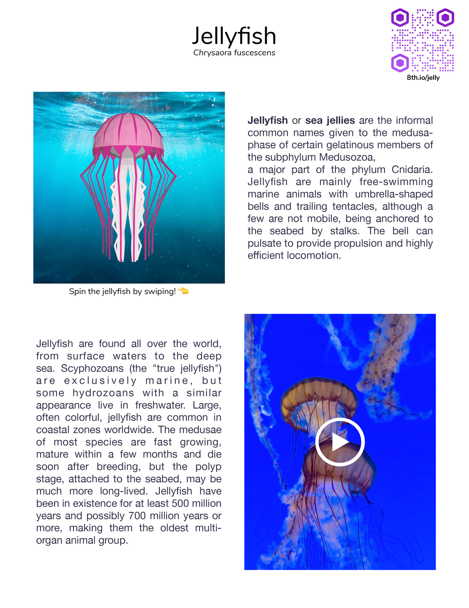

# 8th Wall Web Examples - three.js - Flyer

This example uses image targets to display information about jellyfish on a flyer.

## Uploading to Console

To link the image targets to your app key, you will need to upload (and enable autoload) each image to your project in the 8th Wall Console at www.8thwall.com.
