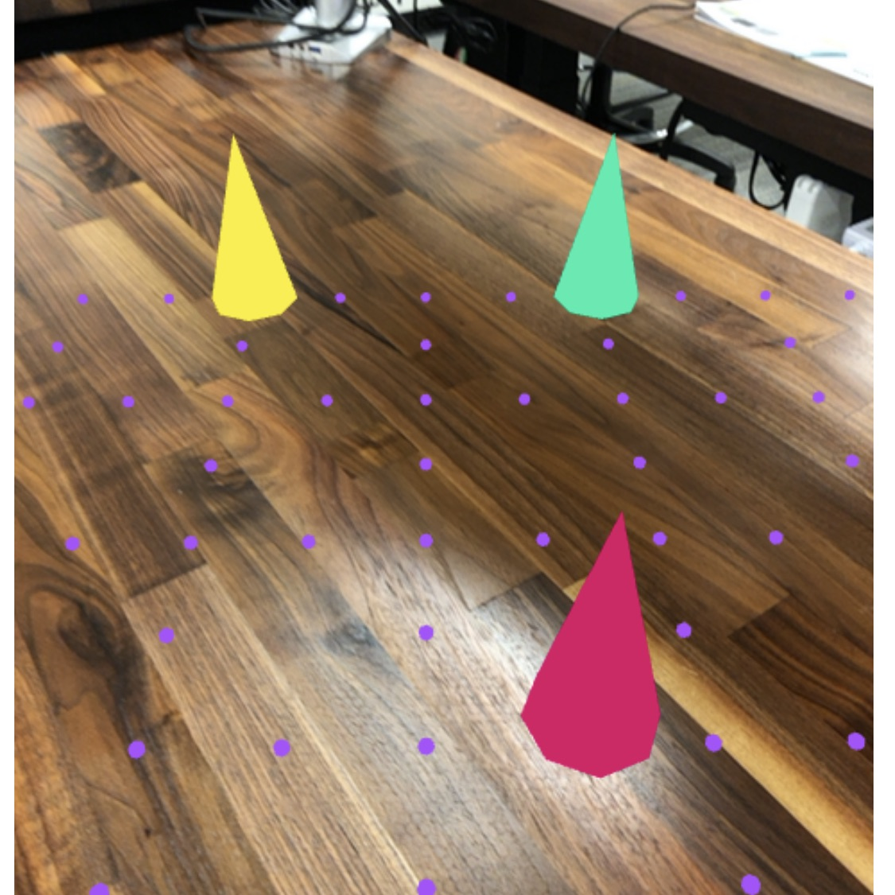
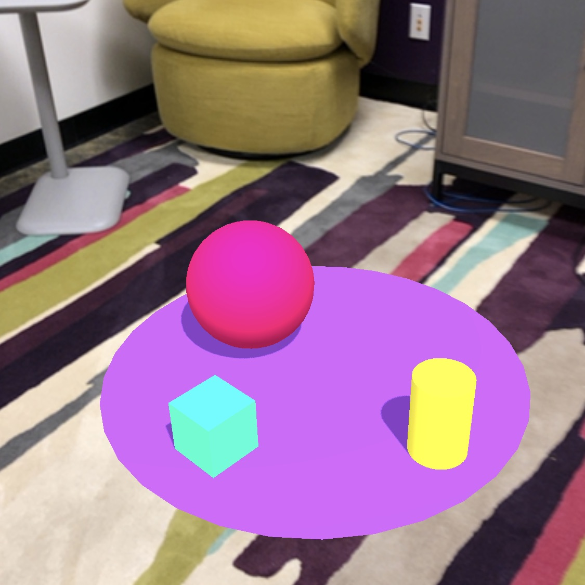
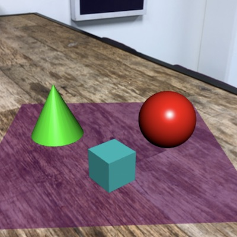

# Getting Started with 8th Wall

Use your own development workflow with 8th Wall self-hosting.

## Clone and run sample projects

Follow the getting started guide by cloning self-hosted sample projects from this repository.

To develop locally you need Node.js and npm installed. If you don't already have Node.js and npm installed, [get it here](https://www.npmjs.com/get-npm).

1. Download the source code from this repository and `cd` into an example of your choice (aframe is recommended for beginners).
2. Replace the app key in `index.html` with your [app key from the project settings page](https://www.8thwall.com/docs/legacy/guides/projects/project-settings/#app-key) in the 8th Wall console.
3. Authorize access to your app key on your device by [authorizing the device](https://www.8thwall.com/docs/legacy/guides/advanced-topics/device-authorization/) or [whitelisting the domain](https://www.8thwall.com/docs/legacy/guides/projects/self-hosted-domains/) (localhost / IP address).
4. Serve a project directory on your local network over HTTPS with [http-server](https://github.com/http-party/http-server#readme). See [Serve projects over HTTPS](https://www.8thwall.com/docs/legacy/guides/advanced-topics/local-hosting/#serve-projects-over-https).
5. Connect to your sever from your device, accept certificate warnings and camera permissions. See [View Project on iOS](https://www.8thwall.com/docs/legacy/guides/advanced-topics/local-hosting/#view-project-on-ios) or [View Project on Android](https://www.8thwall.com/docs/legacy/guides/advanced-topics/local-hosting/#view-project-on-android).

## Serve projects over HTTPS

Browsers require HTTPS certificates to access the camera. Use [http-server](https://github.com/http-party/http-server#readme) to serve project directories with HTTPS.

First, you need to make sure that [openssl](https://github.com/openssl/openssl) is installed, and you have key.pem and cert.pem files. You can generate them using this command:

```
openssl req -newkey rsa:2048 -new -nodes -x509 -days 3650 -keyout key.pem -out cert.pem
```

You will be prompted with a few questions after entering the command. Use 127.0.0.1 as value for Common name if you want to be able to install the certificate in your OS's root certificate store or browser so that it is trusted.

This generates a cert-key pair and it will be valid for 3650 days (about 10 years).

Then you can run `http-server` with `-S` for enabling SSL and `-C` for your certificate file:

```
npx http-server [project-path] -S -C cert.pem
```

Example:

```
npx http-server gettingstarted/aframe/ -S -C cert.pem
```

**NOTE**: The first IP address listed is **127.0.0.1:8080** (which is the loopback
device aka "localhost") and your mobile phone won't be able to connect to that IP address directly.
Please use one of the other IP addresses.

**WINDOWS USERS**: Run the http-server command using a standard Command Prompt window (cmd.exe). The script may generate errors if run from PowerShell.

Learn more in the [http-server documentation](https://github.com/http-party/http-server#tlsssl).

## What you should see 

After following the steps above, you should have fully functional versions of:

threejs | aframe | babylonjs
:-----: | :----: | :-------:
 |  | 
[Try Demo (mobile)](https://apps.8thwall.com/8thwall/gettingstarted_xr3js) | [Try Demo (mobile)](https://apps.8thwall.com/8thwall/gettingstarted_xraframe) | [Try Demo (mobile)](https://apps.8thwall.com/8thwall/gettingstarted_xrbabylonjs)
or scan on phone:<br>  | or scan on phone:<br>  | or scan on phone:<br> 
