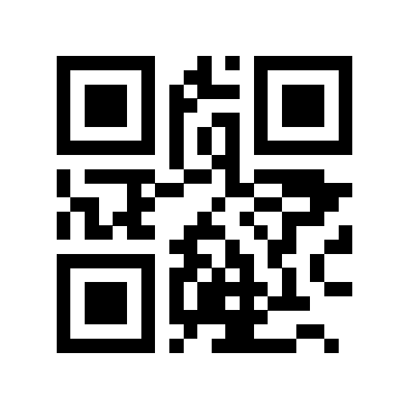
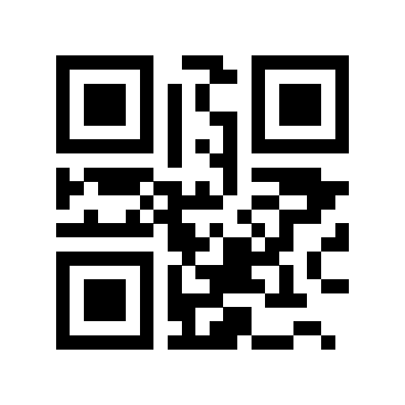
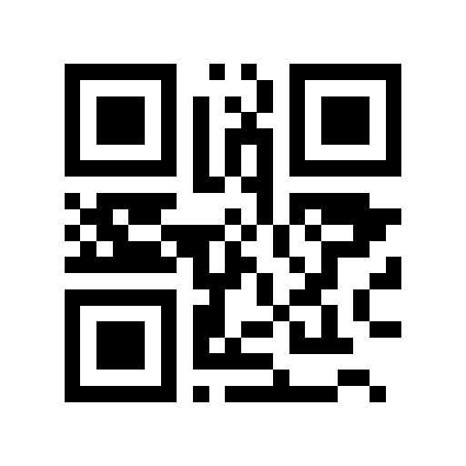

# Getting Started with 8th Wall Web

## Download and run sample projects

To get started with 8th Wall web development, you will need to:
* Create a Pro 8th Wall account at https://www.8thwall.com.
* Create a new self-hosted project and [copy your App Key](https://www.8thwall.com/docs/web/#app-key) from the project settings page.
* Download the source code from this repo, and replace the app key in `index.html` with your app key.
* Serve the source code on your local network over https using the [serve script](https://github.com/8thwall/web/tree/master/serve).
* Authorize access to your app key on your phone by [authorizing the device](https://www.8thwall.com/docs/web/#device-authorization) or [whitelisting the domain](https://www.8thwall.com/docs/web/#connected-domains) (localhost / IP address).
* Connect to your sever from your phone, accept certificate warnings and camera permissions.

## What you should see

After following the steps above, you should have fully functional versions of:

threejs | aframe | babylonjs
:-----: | :----: | :-------:
 |  | 
[Try Demo (mobile)](https://apps.8thwall.com/8thwall/gettingstarted_xr3js) | [Try Demo (mobile)](https://apps.8thwall.com/8thwall/gettingstarted_xraframe) | [Try Demo (mobile)](https://apps.8thwall.com/8thwall/gettingstarted_xrbabylonjs)
or scan on phone:   | or scan on phone:   | or scan on phone:  
