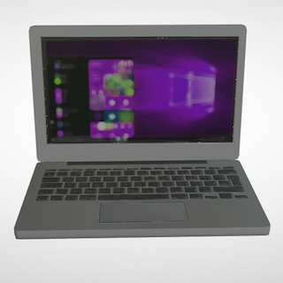
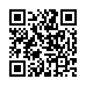
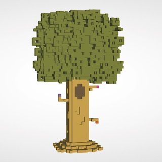
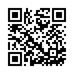

# Getting Started with 8th Wall AR Camera

## Your first AR Camera.

To get started with 8th Wall AR Cameras, you will need to:
* Create 8th Wall account at https://www.8thwall.com
* Add an AR Camera workspace: https://www.8thwall.com/docs/web/#create-workspace
* Create a new camera
* Upload your GLB model file (or use one of the ones below).
* Place model as desired and then publish.
* View your camera at the generated link on your mobile phone, or scan the generated QR code on your phone.
* Share your camera with the world!

## Pick a glb file for your camera.

### Products / Static objects

Preview | File | Link (mobile only) | Scan Link
:-----: | :--: | :----------------: | :-------:
 | [laptop.glb](./glbs/laptop.glb) | [Mobile Link](https://apps.8thwall.com/suznmruj/laptop) | 
 | [tree.glb](./glbs/tree.glb) | [Mobile Link](https://apps.8thwall.com/suznmruj/tree) | 

## Further reading

For detailed instructions on creating or exporting .glb files and their requirements for AR Camera, please see:

https://www.8thwall.com/glb.html
