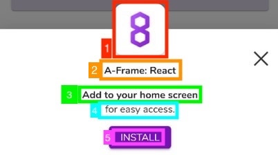
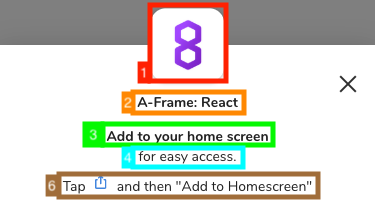

# PWA Installer API

|Functions         | Description|
|------------------|------------|
|[configure](#configure)| Configures the default behavior used to display the install prompt. |
|[pipelineModule](#pipelineModule)| Provides a pipeline module which will handle when a PWA install prompt is displayed in the given application. |
|[setDisplayAllowed](#setDisplayAllowed)| Updates whether it is an acceptable time to display the PWA install prompt. |

## configure
Configures the default behavior used to display the install prompt.

|Parameter|Type|Description|
|---------|----|-----------|
|[displayConfig](#displayConfig)|Object|An object which provides default values for display-related configurations.|
|[promptConfig](#promptConfig)|Object|An object which provides default values which determine when the PWA install prompt should appear.|
|[displayInstallPrompt](#displayInstallPrompt)|Function|A function called by XRExtras to display the install prompt.|
|[hideInstallPrompt](#hideInstallPrompt)|Function|A function called by XRExtras to hide the install prompt.|
|[shouldDisplayInstallPrompt](#shouldDisplayInstallPrompt)|Function|A function called by XRExtras to determin if the install prompt should appear.|

### displayConfig
An object parameter for [configure](#configure) to customize the icon and text that appears on the install prompt. The following values can be provided:

|Key|Type|Description|
|---|----|-----------|
|name|string|The name of the PWA that will appear on the install prompt. On an app built with the 8th Wall Cloud Editor, the default is the PWA Name value specified in the settings. On a self-hosted app, the default is null.|
|iconSrc|string|The icon that will appear on the install prompt. On an app built with the 8th Wall Cloud Editor, the default is the CDN url to the icon uploaded in the settings. On a self-hosted app, the default is null.|
|installTitle|string|The title to display on the install prompt. This text will appear bolded. The default value is “Add to your home screen”.|
|installSubtitle|string|The subtitle to display under the title on the install prompt. The default value is “for easy access.”|
|installButtonText|string|The text on the install button. This text will only be visible on browsers which support the `beforeinstallprompt` window event. The default value is “Install”.|
|iosInstallText|string|The text that appears on iOS Safari instructing users how to add the web app to their home screen. The macro, “$ACTION_ICON” will be replaced by an inline SVG which matches the appearance of the iOS action icon. The default value is “Tap $ACTION_ICON and then "Add to Homescreen"”|

### Legend

| Android | iOS |
|:-------:|:---:|
|||

|Number|`displayConfig` Key|
|---|-----------|
|1|iconSrc|
|2|name|
|3|installTitle|
|4|installSubtitle|
|5|installButtonText|
|6|iosInstallText|

### promptConfig
An object for [configure](#configure) to customize when the install prompt should appear. The following values can be provided:

|Key|Type|Description|
|---|----|-----------|
|delayAfterDismissalMillis|int|The amount of time, in milliseconds, that should pass before attempting to display the install prompt to the user after they have previously dismissed it. The default is 90 days (in milliseconds).|
|minNumVisits|int|The minimum number of times a user must visit the web app before attempting to display the install prompt. The default is 2.|

### displayInstallPrompt
A function called by XRExtras to display the install prompt. If this function is provided, it is highly recommended that [hideInstallPrompt](#hideInstallPrompt) is provided as well. To override, provide a function that takes in the following parameters:

|Parameter|Type|Description|
|---------|----|-----------|
|[displayConfig](#displayConfig)|Object|The display config for the install prompt.|
|onInstalled|Function|A function to call from your custom UI to tell XRExtras the app has been installed.|
|onDismissed|Function| A function to call from your custom UI to tell XRExtras that the install prompt has been dismissed.|

This should only be overridden if custom UI for an install prompt is going to be displayed. displayConfig will provide values which are recommended to be used in the custom UI. onInstalled and onDismissed should be called from the custom UI when the PWA has been installed or the prompt has been dismissed, respectively.

#### Example
```javascript
const displayInstallPrompt = (displayConfig, onInstalled, onDismissed) => {
  // Create custom UI using displayConfig values.
  // Assign your install button onclick to be onInstalled.
  // Assign your close button onclick to be onDismissed.
}
const hideInstallPrompt = () => {
  // Hide UI that was created & displayed by displayInstallPrompt.
}
XRExtras.PwaInstaller.configure({
  displayInstallPrompt,
  hideInstallPrompt
})
```

### hideInstallPrompt
A function called by XRExtras to hide the install prompt. If this function is provided, it is highly recommended that [displayInstallPrompt](#displayInstallPrompt) is provided as well.

#### Example
```javascript
const displayInstallPrompt = (displayConfig, onInstalled, onDismissed) => {
  // Create custom UI using displayConfig values.
  // Assign your install button onclick to be onInstalled.
  // Assign your close button onclick to be onDismissed.
}
const hideInstallPrompt = () => {
  // Hide UI that was created & displayed by displayInstallPrompt.
}
XRExtras.PwaInstaller.configure({
  displayInstallPrompt,
  hideInstallPrompt
})
```

### shouldDisplayInstallPrompt
A function called by XRExtras to determine if the install prompt should appear. To override, provide a function that takes in the following parameters and returns a boolean:

|Parameter|Type|Description|
|---------|----|-----------|
|[promptConfig](#promptConfig)|Object|The prompt config for the install prompt.|
|lastDismissalMillis|int|The timestamp, in milliseconds, of the last time the user dismissed the install prompt.
|numVisits|int|The number of times the user has visited this web app.|

If no value is provided, the default behavior is to display the install prompt only if the following requirements are met:
1) The user has visited the web app at least 2 times.
2) The user has not previously dismissed the install prompt in the last 90 days.
3) On Android, the `beforeinstallprompt` event has been triggered.

#### Example
```javascript
const shouldDisplayInstallPrompt = (promptConfig, lastDismissalMillis, numVisits) => {
  if (promptConfig.minNumVisits >= numVisits) {
    // Minimum number of visits has not been met yet.
    return false
  }
  if (Date.now() < lastDismissalMillis + promptConfig.delayAfterDismissalMillis) {
    // Not enough time has passed since the last dismissal.
    return false
  }
  if (/* MY CUSTOM CHECKS */) {
    return true
  } else {
    return false
  }
}
XRExtras.PwaInstaller.configure({
  shouldDisplayInstallPrompt
})
```

## pipelineModule
Provides a pipeline module which will handle when a PWA install prompt is displayed in the given application.

This pipeline module detects if the running application is installable on the current device, then displays a platform-specific install prompt after the application has loaded. The default behavior is to display the install prompt only after the user has visited the web app at least 2 times, and the user has not dismissed a previous install prompt in the last 90 days. To customize this behavior, see [configure](#configure). This function should not be used when manually displaying the install prompt through [setDisplayAllowed](#setDisplayAllowed).

## setDisplayAllowed
Updates whether it is an acceptable time to display the PWA install prompt.

|Parameter|Type|Description|
|---------|----|-----------|
|displayAllowed|boolean| If true, this will attempt to display the install prompt immediately. If the display prompt cannot be displayed immediately, it will schedule a check every 5 seconds to attempt to display the install prompt. If false, this will immediately hide the install prompt, if visible, and cancel any scheduled display events.|
